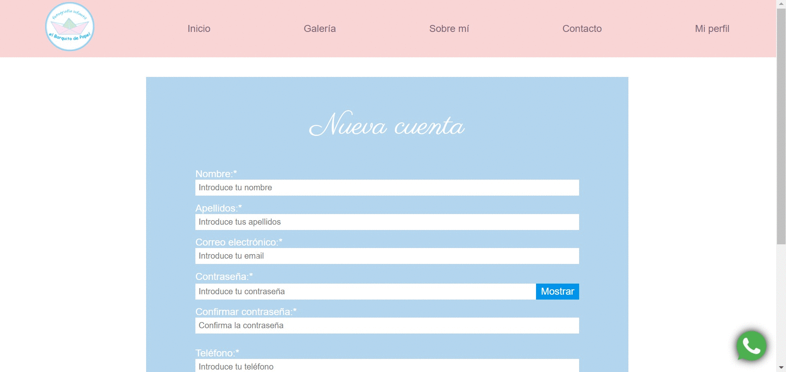
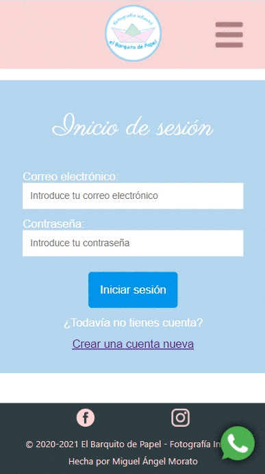
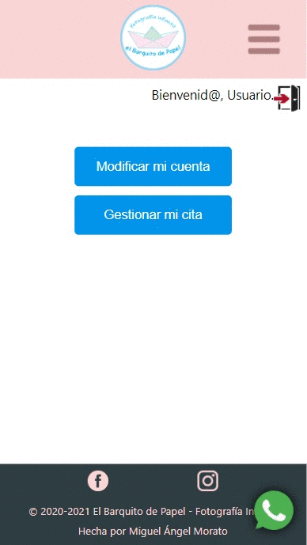
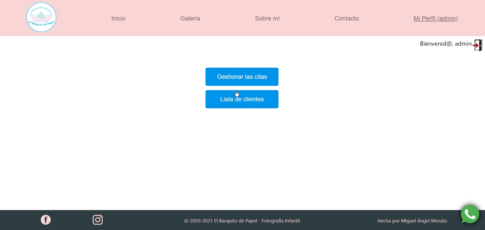
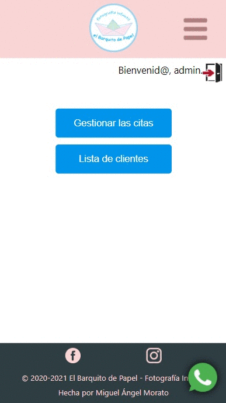

<h1 align="center"> El Barquito de Papel - Fotografía infantil </h1>

---

## About this 🤔
Its main feature is that it allows our clients to make appointments on their own through the webapp itself. Moreover it is responsive, which means total accesibility and functionality regardless of which device we use.
> Note: This repository is the frontend of the application.
> Backend is here: [repository](https://github.com/Cheroki84/webapp-photography-b)

---

## Do you want to see the application running? 🚀
 https://www.elbarquitodepapelfi.com
 > If you have problems accessing it, try it [here](https://webapp-photography-f.herokuapp.com/)

---

## Technologies used ✅
- Git
- JavaScript
- React
- Redux
- SASS

---

## Libraries used 📚
- axios
- moment
- react-data-table
- react-datepicker
- react-grid-gallery
- reactstrap
- regEx
- sweetalert2

---

## Tools used  🛠️
- Git Flow
- GitHub
- Heroku
- React Developer Tools
- Redux DevTools
- Trello

---

## Some working samples ⚙️
### Page Views
- #### Desktop version 💻

 
- #### Mobile version 📱

    

 

### Register and login
- #### Desktop version 💻

- #### Mobile version 📱

    

 

### Client Dashboard. (Profile modification. Reservation and cancellation of an appointment)

- #### Desktop version 💻

 
- #### Mobile version 📱

    

 

### Admin Dashboard. Management of appointments and clients

- #### Desktop version 💻

 
- #### Mobile version 📱

    

---

[Trello Board](https://trello.com/b/bCUUWx7S/webapp-photography)

